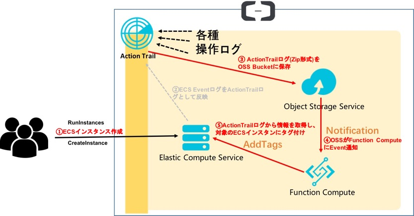

# はじめに
これはAlibaba Cloudだけの話ではない。  
開発環境にECSインスタンスが乱立して、だれがどのインスタンスを作ったか全くわからいないカオス状態になっている時がある。

ECSインスタンスが作成される際に、自動的に作成者の情報がECSインスタンスに付与されるときっと管理者も開発者も幸せになれる。  
Alibaba Cloud利用に限るが、下記自動的にECSインスタンスにTagをつける仕組みを作った。  
詳細は下記の投稿にて、ご確認ください。  
[[運用子ネタ]「もう勘弁してよ、このECSインスタンを作ったのはだれ ?」と悩んでいる方へ](https://qiita.com/jobbin/items/44197030d87901249d70)


# アーキテクチャ



## 本仕組みに利用されるAliCloud Product / Tool

- ActionTrail
    - AliCloud操作ログを取得し、OSSに保存する
- OSS
    - ActionTrailログをOSS Bucketに保存する
    - ActionTrailログがOSSに保存されたら、OSSがFunction ComputeにEventを通知する
- Log Service
    - Function Computeの実行ログを保存する
- RAM
    - Role
        - Function Compute実行時、ログをLog Serviceに保存する際に必要
    - AccessKey
        - Function ComputeがECSインスタンスにTagをつける際に必要 
- Function Compute
    - OSSからActionTrailログのEvent情報を受信し、その情報を利用して、ECSインスタンスにTagをつける
- ECS
- FUN
  - Alibaba開発したServelessに特化した開発ツール
  - GitHub Repo : [fun](https://github.com/aliyun/fun)

# その他

- [ECS作成時のActionTrail log](./run_ecs_actiontrail_log.json)
- [OSS trigger の情報](./oss_trigger_info.json)

# 設定手順

- ActionTrailログを保存するために、ActionTrail専用のOSS Bucketを作成
- ログはActionTrail専用のOSS Bucketに保存するようにActionTrailを有効化
- fun を利用するために、AliCloudの OpenAPI Explorer の [Onlie Linux Shell](https://api.alibabacloud.com/#/cli) の操作画面にたどり着く
    - ローカル環境の場合は [公式な手順](https://github.com/aliyun/fun/blob/master/docs/usage/installation.md) を参考に、fun をインストール
- OpenAPI Explorer の [Onlie Linux Shell](https://api.alibabacloud.com/#/cli) 上 fun を利用する場合、funのconfigを設定する必要がない  
ローカル環境での場合はRAM UserのAccessKey, SecretKeyを利用して、下記のようにfunのconfigを設定

```
$ fun config
? Aliyun Account ID 
? Aliyun Access Key ID 
? Aliyun Secret Access Key 
? Default region name ap-northeast-1
? The timeout in seconds for each SDK client invoking 10
? The maximum number of retries for each SDK client 6

```
- GitHubからサンプルコードを取得

```
git clone https://github.com/jobbin/fun_with_serverless.git
```

- add_tag_to_ecsのディレクトリ配下に移動
```
cd fun_with_serverless/add_tag_to_ecs
```
- Function Compute に下記のものをデプロイする
    - Log Service
    - RAM Role
    - Function Compute 
```
fun deploy
```

- Function Compute の function(add_tag_to_ecs) の管理画面を開き、環境変数のACCESS_KEY_ID と ACCESS_KEY_SECRET を設定する

- function(add_tag_to_ecs) に 下記のように OSS Trigger を設定する
    - Trigger Type: OSS
    - Trigger Name: 適宜
    - Bucket: ActionTrailログ保存用Bucket
    - Events は oss:ObjectCreated:PutObject

- ECSインスタンを作成して、自動的にOwnerタグが付与されているかを確認
    - Ownerタグの値は利用中のアカウント名(RAM User / root)


